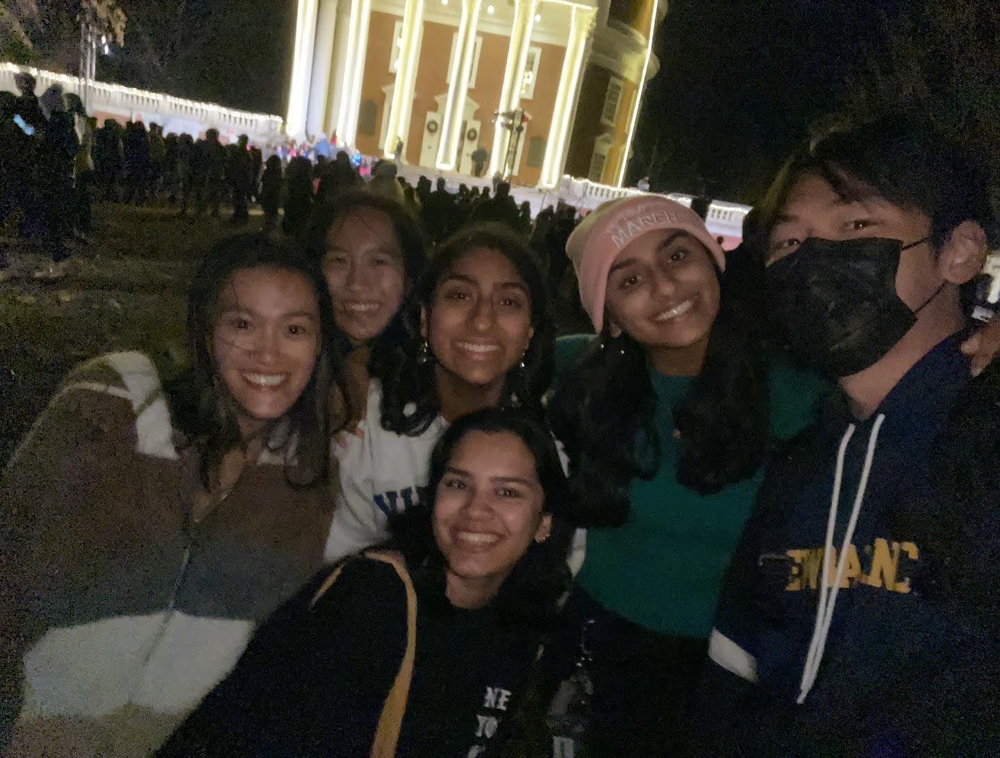

# This is Jeff's awesome website

This is an awesome website about data science and elmo?

Sometimes I use [google](https://www.google.com/) to do data science when I'm stuck

These are my friends. They're chill. 

This first version is using markdown embedding

Another way: 

this is using html embedding.

These do not go into a code chunk. If you want to have control over size, html is prob the way to go.

If you'd like to learn more about this website, visit [this page](about.html)

CASE SENSITIVE! be careful with the links.

